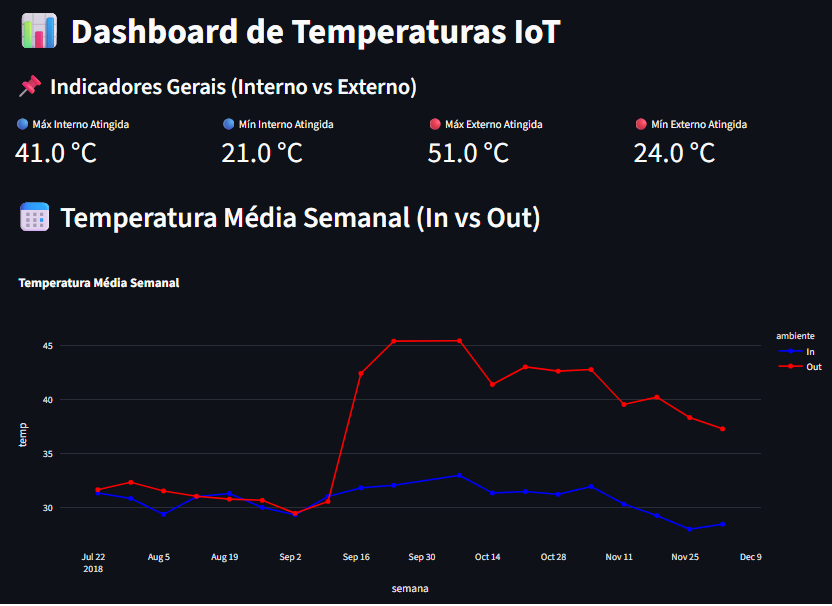

# 📊 Dashboard de Temperaturas IoT

Projeto desenvolvido para análise de dados de temperatura coletados por dispositivos IoT, utilizando PostgreSQL, Docker e Streamlit para visualização interativa.

---

## 🎥 Apresentação do Projeto

Clique no link abaixo para assistir à demonstração completa do dashboard e explicação do pipeline:

👉 [Assistir ao vídeo](https://www.youtube.com/watch?v=siV-DgenpIE)

---

## 📷 Dashboard



---

## 🚀 Tecnologias Utilizadas

- Python  
- Streamlit  
- PostgreSQL  
- Docker  
- Pandas  
- Plotly  

---

## 📊 Funcionalidades

### 📌 Indicadores Gerais (KPIs)
- Temperatura máxima e mínima (In/Out)

### 🌡️ Comparação de Temperatura
- Análise ao longo do tempo entre ambientes

### ⏱️ Leituras por Hora
- Distribuição das medições ao longo do dia

### 📈 Temperaturas por Dia
- Máximas e mínimas diárias

---

## 💡 Insights

- O ambiente externo apresenta maior variação térmica  
- O ambiente interno se mantém mais estável  
- Existem padrões de coleta ao longo do dia  
- As variações diárias seguem um comportamento consistente  

---

## 🗄️ Banco de Dados

### 📋 Tabela
- `temperature_readings`

### 📊 Views
- `temp_in_out`  
- `leituras_por_hora`  
- `temp_max_min_por_dia`  
- `temp_in_out_timeline`  

---

## ⚙️ Como Executar

### 🐳 Execução com Docker (RECOMENDADO)

Execute o comando abaixo para subir toda a aplicação (banco + dashboard):

```bash
docker compose up --build
```

## 🌐 Acesso no navegador
http://localhost:8501


## ⚠️ Observações

- O banco de dados é inicializado automaticamente via Docker  
- Os dados são carregados automaticamente a partir do arquivo CSV  
- Não é necessário inserir dados manualmente  


## 💻 Execução Local (opcional)

```bash
pip install -r requirements.txt
python -m streamlit run src/dashboard.py
```

## Objetivo do projeto

Demonstrar a aplicação de um pipeline completo de dados IoT, envolvendo:

- Coleta de dados  
- Armazenamento em banco  
- Tratamento e transformação  
- Visualização interativa  

## Autor

Thiago Henrique
Estudante de Análise e Desenvolvimento de Sistemas
